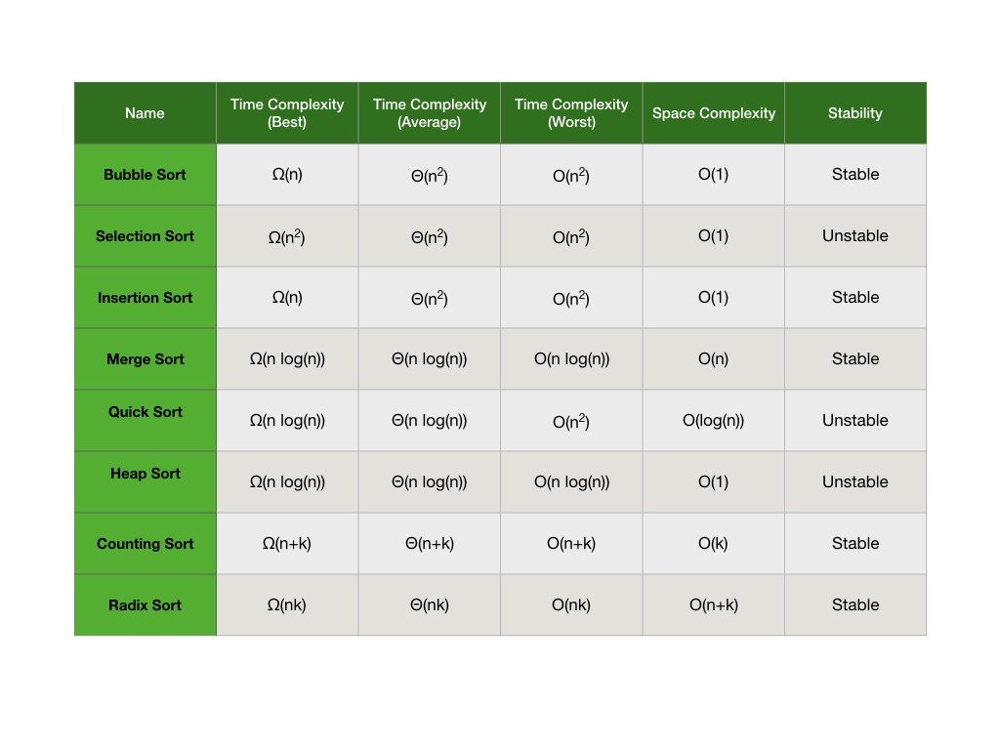
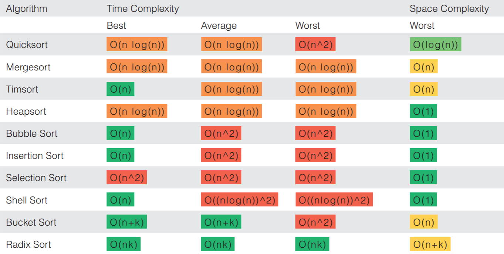

# Sorting algorithms. 
[](https://travis-ci.com/serveriev/sorting-algorithms)

> Implementation of sorting algorithms on java

## Context

❌ Selection Sort

❌ Bubble Sort

❌ Insertion Sort

❌ Merge Sort

❌ Quick Sort

❌ ShellSort

❌ Timsort

❌ ShellSort

❌ Radix Sort

❌ Heap Sort

❌ Bucket Sort

## Complexity




## Run tests

```sh
mvn test
```
